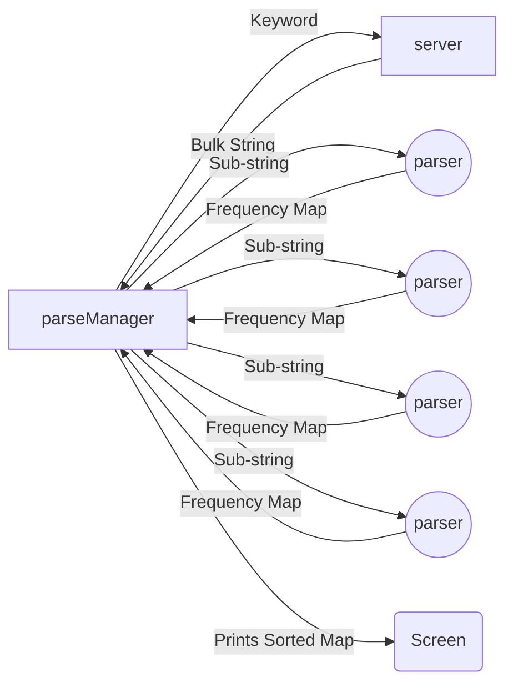

# GoLang Keyword Density Analyser

Implemented in GoLang, this application is used to utilise concurrency to increase the speedup of keyword density analysis on large strings between **50k - 500k** words long.

Compared to a basic sequential implementation in C++, this application runs **50x faster** on a dataset of 70k words on an intel i5 3.3GHz CPU.

## About

This application was built in parallel with a CUDA (C++) implementation, also available on my Github, which takes advantage of GPU threads. Out of the two, this solution ran faster and scaled further.

## Getting Started

**Prerequisites**

1.  Install Go by following the instructions as seen on: https://golang.org/doc/install

----------

**Get Started:**

1.  Clone the Repo.
2.  Ensure your server has a route which expects a { keyword: "sample" } and returns a String.
3.  Open textprocessing.go in a text editor and change line 381 to your server API address.
4.  Open terminal/CMD and run go run textprocessing.go from within the directory.

## Files

 - Test Strings.zip - Contains sample input files to provide guidance on data format.
 - results.txt - Sample output from the application.
 - sampleresponse.txt - This application expects to receive data from a server, this exemplifies the format which data is accepted.
 - textprocessing.go - GoLang file containing parseManager and parser go routines.

## Performance
The performance of this application has been measured against a sequential C++ solution and a shared memory solution in NVIDIA's CUDA.

**Notice for particularly small datasets, this solution is slower, due to an increased overhead.**

## Data Flow Diagram

The data flow for this program looks like:

**Can be viewed in stackedit.io**

